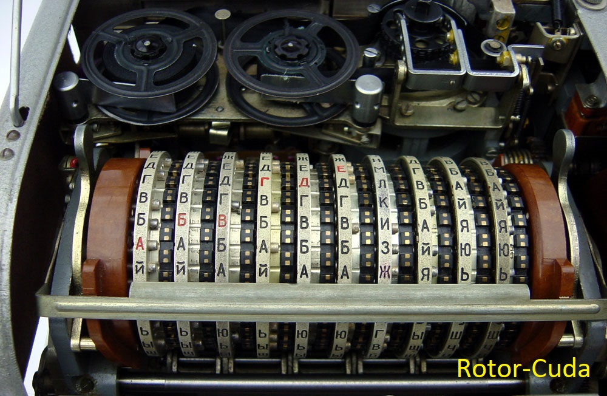

# Rotor-Cuda  v1.07


This is a modified version of [KeyHunt v1.7](https://github.com/kanhavishva/KeyHunt-Cuda).
A lot of gratitude to all the developers whose codes has been used here.

Telegram group [**CryptoCrackers**](https://t.me/CryptoCrackersUK)

## Changes:
- Default Random 95% (252-256) bit + 5% (248-252) bit
- Random in a given bit range (1-256)
- Random between given bit ranges -n ? -z ?
- Random between the specified special for Puzzle --range 8000000000000000:ffffffffffffffff
- Time until the end of the search [years days hours minutes seconds] (max 300 years)
- Parameter -d 0 expert mode min. information (good for many GPUs)
- Automatic creation of Rotor-Cuda_START.bat with the specified cmd parameters 
- Continuation of the search in the range, from the last checkpoint 
- Ability to specify the time in minutes saving checkpoints 
- Many small visual improvements

### To search in a Range (CPUs)
- **-t ?** how many cpu cores to use? (1-128 max)
- **-n ?** save checkpoint every ? minutes. (1-1000)
- If you do not specify -n ? (search without continuing) 
- After the Rotor-Cuda_Continue.bat file appears, you can continue from the last checkpoint.
- To continue correctly, do not change the parameters inside the bat file.
- **IF YOU DO NOT NEED TO CONTINUE, DELETE THE Rotor-Cuda_Continue.bat !!!**
- If you start another range without deleting, a counter will be taken from the baht file and an incorrect continuation will start instead of searching. 
- Example puzzle: Checkpoin recording every 2 minutes: 
- ```Rotor-Cuda.exe -t 6 -m address --coin BTC --range 8000000000000000:ffffffffffffffff 16jY7qLJnxb7CHZyqBP8qca9d51gAjyXQN  -n 2```

### Random (CPUs)
- **-t ?** how many cpu cores to use? (1-128 max)
- **-r ?** How many billions values to update starting Private Keys? (1-100)
- **-n ?** (1-256) bit. If you do not specify -n will be the default random 95% (252-256) bit + 5% (248-252) bit
- **-z ?** (end random range must be greater than -n value) example: -n 63 -z 254
- Example: Random in the 253rd range: 
- Random: ```Rotor-Cuda.exe -t 2 -m address --coin BTC -r 1 1PWCx5fovoEaoBowAvF5k91m2Xat9bMgwb -n 253```
- Example: Random between 125 and 254 bit range:
- Random: ```Rotor-Cuda.exe -t 2 -m address --coin BTC -r 1 1PWCx5fovoEaoBowAvF5k91m2Xat9bMgwb -n 125 -z 254```
- Random for search [puzzle](https://privatekeys.pw/puzzles/bitcoin-puzzle-tx) Example puzzle64:
- ```Rotor-Cuda.exe -t 2 -m address --coin BTC -r 1 --range 8000000000000000:ffffffffffffffff 16jY7qLJnxb7CHZyqBP8qca9d51gAjyXQN```
- [**How to create databases**](https://github.com/phrutis/Rotor-Cuda/blob/main/Others/) and [**additional parameters**](https://github.com/phrutis/Rotor-Cuda/blob/main/Others/Help.md)
### CPU Bitcoin Multi Address mode:
- Range: ```Rotor-Cuda.exe -t 1 -m addresses --coin BTC --range 1:1fffffffff -i puzzle_1_37_hash160_out_sorted.bin```
- Random: ```Rotor-Cuda.exe -t 1 -m addresses --coin BTC -r 1 -i base160sorted.bin```
---
### CPU Bitcoin Single Addres mode:
- Range: ```Rotor-Cuda.exe -t 1 -m address --coin BTC --range 400000000:7ffffffff 1PWCx5fovoEaoBowAvF5k91m2Xat9bMgwb```
- Random: ```Rotor-Cuda.exe -t 1 -m address --coin BTC -r 1 1PWCx5fovoEaoBowAvF5k91m2Xat9bMgwb```
---
### CPU ETHEREUM Multi Address mode:
- Range: ```Rotor-Cuda.exe -t 1 -m addresses --coin eth --range 1:1fffffffff -i puzzle_1_37_addresses_eth_sorted.bin```
- Random: ```Rotor-Cuda.exe -t 1 -m addresses --coin eth -r 1 -i base160_eth_sorted.bin```
---
### CPU ETHEREUM Single Addres mode:
- Range: ```Rotor-Cuda.exe -t 1 -m address --coin eth --range 8000000:fffffff 0xfda5c442e76a95f96c09782f1a15d3b58e32404f```
- Random: ```Rotor-Cuda.exe -t 1 -m address --coin eth -r 1 0xfda5c442e76a95f96c09782f1a15d3b58e32404f```
---
### CPU Public keys Multi X Points mode:
- Range: ```Rotor-Cuda.exe -t 1 -m xpoints --coin BTC --range 1:1fffffffff -i xpoints_1_37_out_sorted.bin```
- Random: ```Rotor-Cuda.exe -t 1 -m xpoints --coin BTC -r 1 -i Pubkeys0.1up.bin```
---
### CPU Public key Single X Point mode:
- Range: ```Rotor-Cuda.exe -t 1 -m xpoint --coin BTC --range 8000000000:ffffffffff a2efa402fd5268400c77c20e574ba86409ededee7c4020e4b9f0edbee53de0d4```
- Random: ```Rotor-Cuda.exe -t 1 -m xpoint --coin BTC -r 1 a2efa402fd5268400c77c20e574ba86409ededee7c4020e4b9f0edbee53de0d4```
---
### Example Range mode -n 2 (6 cores):
```
C:\Users\user>Rotor-Cuda.exe -t 6 -m addresses --coin BTC --range 1000000:fffffffffffff -i all.bin -n 2

  Rotor-Cuda v1.07

  COMP MODE    : COMPRESSED
  COIN TYPE    : BITCOIN
  SEARCH MODE  : Multi Address
  DEVICE       : CPU
  CPU THREAD   : 6
  SSE          : YES
  BTC HASH160s : all.bin
  OUTPUT FILE  : Found.txt

  Loading      : 100 %
  Loaded       : 23,908,481 Bitcoin addresses

  Bloom at     : 0000020CAF5ADE30
  Version      : 2.1
  Entries      : 47816962
  Error        : 0.0000010000
  Bits         : 1374985116
  Bits/Elem    : 28.755175
  Bytes        : 171873140 (163 MB)
  Hash funcs   : 20

  Site         : https://github.com/phrutis/Rotor-Cuda
  Donate       : bc1qh2mvnf5fujg93mwl8pe688yucaw9sflmwsukz9

  Start Time   : Sun Nov  7 23:46:43 2021
  Global start : 1000000 (25 bit)
  Global end   : FFFFFFFFFFFFF (52 bit)
  Global range : FFFFFFEFFFFFF (52 bit)

  Rotor info   : Divide the range FFFFFFEFFFFFF (52 bit) into CPU 6 cores for fast parallel search

  Rotor info   : Save checkpoints every 2 minutes. For continue range, run the bat file Rotor-Cuda_Continue.bat
  CPU Core (1) : 2AAAAAB7FFFFF -> 5555555FFFFFE
  CPU Core (2) : 1000000 -> 2AAAAAB7FFFFF
  CPU Core (3) : 5555555FFFFFE -> 80000007FFFFD
  CPU Core (4) : 80000007FFFFD -> AAAAAAAFFFFFC
  CPU Core (5) : AAAAAAAFFFFFC -> D5555557FFFFB
  CPU Core (6) : D5555557FFFFB -> FFFFFFFFFFFFF

  [00:08:26] [10AAD8FAE] [F: 0] [Y:015 D:260] [C: 0.000100 %] [CPU 6: 9.09 Mk/s] [T: 4,507,684,864]
```

### Example continuation from Rotor-Cuda_Continue.bat
```
Rotor-Cuda v1.07

  COMP MODE    : COMPRESSED
  COIN TYPE    : BITCOIN
  SEARCH MODE  : Multi Address
  DEVICE       : CPU
  CPU THREAD   : 6
  SSE          : YES
  BTC HASH160s : all.bin
  OUTPUT FILE  : Found.txt

  Loading      : 100 %
  Loaded       : 23,908,481 Bitcoin addresses

  Bloom at     : 000002331C2E9DB0
  Version      : 2.1
  Entries      : 47816962
  Error        : 0.0000010000
  Bits         : 1374985116
  Bits/Elem    : 28.755175
  Bytes        : 171873140 (163 MB)
  Hash funcs   : 20

  Site         : https://github.com/phrutis/Rotor-Cuda
  Donate       : bc1qh2mvnf5fujg93mwl8pe688yucaw9sflmwsukz9

  Start Time   : Sun Nov  7 23:56:05 2021
  Rotor        : Continuing search from BAT file. Checkpoint created: Sun Nov  7 23:54:13 2021

  Global start : 1000000 (25 bit)
  Global end   : FFFFFFFFFFFFF (52 bit)
  Global range : FFFFFFEFFFFFF (52 bit)

  Rotor info   : Continuation... Divide the remaining range FFFFF10DDD7F9 (52 bit) into CPU 6 cores

  Rotor info   : Save checkpoints every 2 minutes. For continue range, run the bat file Rotor-Cuda_Continue.bat
  CPU Core (2) : 28B05C00 -> 2AAAAD3305BFF
  CPU Core (1) : 2AAAAD3305BFF -> 555557DB05BFE
  CPU Core (3) : 8000028305BFD -> AAAAAD2B05BFC
  CPU Core (4) : 555557DB05BFE -> 8000028305BFD
  CPU Core (5) : AAAAAD2B05BFC -> D55557D305BFB
  CPU Core (6) : D55557D305BFB -> FFFFFFFFFFFFF

  [00:00:12] [F033463D] [F: 0] [Y:015 D:351] [C: 0.000091 %] [CPU 6: 8.95 Mk/s] [T: 4,108,218,368]
```

### Example Random mode use -n 253 -z 254 (6 cores):
```
C:\Users\user>Rotor-Cuda.exe -t 6 -m addresses --coin BTC -i all.bin -r 1 -n 253 -z 254

  Rotor-Cuda v1.07

  COMP MODE    : COMPRESSED
  COIN TYPE    : BITCOIN
  SEARCH MODE  : Multi Address
  DEVICE       : CPU
  CPU THREAD   : 6
  SSE          : YES
  BTC HASH160s : all.bin
  OUTPUT FILE  : Found.txt

  Loading      : 100 %
  Loaded       : 23,908,481 Bitcoin addresses

  Bloom at     : 000001AA32D29D80
  Version      : 2.1
  Entries      : 47816962
  Error        : 0.0000010000
  Bits         : 1374985116
  Bits/Elem    : 28.755175
  Bytes        : 171873140 (163 MB)
  Hash funcs   : 20

  Site         : https://github.com/phrutis/Rotor-Cuda
  Donate       : bc1qh2mvnf5fujg93mwl8pe688yucaw9sflmwsukz9

  Start Time   : Sun Nov  7 23:58:07 2021


  ROTOR Random : Private keys random 253 <~> 254 (bit)
  Base Key     : Randomly changes 6 Private keys every 1,000,000,000 on the counter

  [00:00:27] [R: 0] [11969326AD87F607FEABE042E9CE70552742E0C0830BF138368058C87963E138] [F: 0] [CPU 6: 9.07 Mk/s] [T: 250,746,880]
 ```

### To search in a Range Add parameters (GPUs)
- **-n ?** save checkpoint every ? minutes. (1-10000)
- If you do not specify -n ? (search without continuing) 
- After the Rotor-Cuda_Continue.bat file appears, you can continue from the last checkpoint.
- To continue correctly, do not change the parameters inside the file.
- **If you do not need to continue, DELETE the Rotor-Cuda_Continue.bat !!!** 
---
### For Random use - r 100 (GPUs)
- **-r ?** How many billions to update 65535 starting Private Keys? (1-100000) Recommended every 5-15 minutes. (-n 100)
- **-n ?** (1-256) bit. If you do not specify -n will be the default 95% (252-256) bit + 5% (248-252) bit
- **-z ?** (end random range must be greater than -n value) example: -n 252 -z 256
- Random for search [puzzle](https://privatekeys.pw/puzzles/bitcoin-puzzle-tx)64 example:
- ```Rotor-Cuda.exe -g --gpui 0 --gpux 256,256 -m address --coin BTC -r 100 --range 8000000000000000:ffffffffffffffff 16jY7qLJnxb7CHZyqBP8qca9d51gAjyXQN```
- If you know that your parameters are correct, use the expert mode -d 0 If you are using many GPUs use -d 0 for convenience 
- If your GPU is weaker than RTX 1080 or the driver crashes. Remove **--gpux 256,256** from the row the grid will be auto-assigned.
- [**How to create databases**](https://github.com/phrutis/Rotor-Cuda/blob/main/Others/) and [**additional parameters**](https://github.com/phrutis/Rotor-Cuda/blob/main/Others/Help.md)
---
### GPU Bitcoin Multi Address mode:
- Range: ```Rotor-Cuda.exe -g --gpui 0 --gpux 256,256 -m addresses --coin BTC --range 1:1fffffffff -i puzzle_1_37_hash160_out_sorted.bin```
- Random: ```Rotor-Cuda.exe -g --gpui 0 --gpux 256,256 -m addresses --coin BTC -r 250 -i base160sorted.bin```
---
### GPU Bitcoin Single Addres mode:
- Range: ```Rotor-Cuda.exe -g --gpui 0 --gpux 256,256 -m address --coin BTC --range 400000000:7ffffffff 1PWCx5fovoEaoBowAvF5k91m2Xat9bMgwb```
- Random: ```Rotor-Cuda.exe -g --gpui 0 --gpux 256,256 -m address --coin BTC -r 250 1PWCx5fovoEaoBowAvF5k91m2Xat9bMgwb```
---
### GPU ETHEREUM Multi Address mode:
- Range: ```Rotor-Cuda.exe -g --gpui 0 --gpux 256,256 -m addresses --coin eth --range 1:1fffffffff -i puzzle_1_37_addresses_eth_sorted.bin```
- Random: ```Rotor-Cuda.exe -g --gpui 0 --gpux 256,256 -m addresses --coin eth -r 250 -i base160_eth_sorted.bin```
---
### GPU ETHEREUM Single Addres mode:
- Range: ```Rotor-Cuda.exe -g --gpui 0 --gpux 256,256 -m address --coin eth --range 8000000:fffffff 0xfda5c442e76a95f96c09782f1a15d3b58e32404f```
- Random: ```Rotor-Cuda.exe -g --gpui 0 --gpux 256,256 -m address --coin eth -r 250 0xfda5c442e76a95f96c09782f1a15d3b58e32404f```
---
### GPU Public key Multi X Points mode:
- Range: ```Rotor-Cuda.exe -g --gpui 0 --gpux 256,256 -m xpoints --coin BTC --range 1:1fffffffff -i xpoints_1_37_out_sorted.bin```
- Random: ```Rotor-Cuda.exe -g --gpui 0 --gpux 256,256 -m xpoints --coin BTC -r 250 -i Pubkeys1up.bin```
---
### GPU Public key Single X Point mode [Puzzle](https://privatekeys.pw/puzzles/bitcoin-puzzle-tx)120 example:
- Range: ```Rotor-Cuda.exe -g --gpui 0 --gpux 256,256 -m xpoint --coin BTC --range 800000000000000000000000000000:ffffffffffffffffffffffffffffff ceb6cbbcdbdf5ef7150682150f4ce2c6f4807b349827dcdbdd1f2efa885a2630```
- Random: ```Rotor-Cuda.exe -g --gpui 0 --gpux 256,256 -m xpoint -r 100 --coin BTC --range 800000000000000000000000000000:ffffffffffffffffffffffffffffff ceb6cbbcdbdf5ef7150682150f4ce2c6f4807b349827dcdbdd1f2efa885a2630```
- [**How to create databases**](https://github.com/phrutis/Rotor-Cuda/blob/main/Others/) and [**additional parameters**](https://github.com/phrutis/Rotor-Cuda/blob/main/Others/Help.md)
---
### Example Range mode and -n 2:
```
C:\Users\user>Rotor-Cuda.exe -g --gpui 0 --gpux 256,256 -m xpoint --coin BTC --range 8000000000:ffffffffff a2efa402fd5268400c77c20e574ba86409ededee7c4020e4b9f0edbee53de0d4 -n 2

  Rotor-Cuda v1.07

  COMP MODE    : COMPRESSED
  COIN TYPE    : BITCOIN
  SEARCH MODE  : Single X Point
  DEVICE       : GPU
  CPU THREAD   : 0
  GPU IDS      : 0
  GPU GRIDSIZE : 256x256
  SSE          : NO
  BTC XPOINT   : a2efa402fd5268400c77c20e574ba86409ededee7c4020e4b9f0edbee53de0d4
  OUTPUT FILE  : Found.txt

  Start Time   : Sun Nov  7 23:59:13 2021
  Global start : 8000000000 (40 bit)
  Global end   : FFFFFFFFFF (40 bit)
  Global range : 7FFFFFFFFF (39 bit)

  GPU          : GPU #0 NVIDIA GeForce RTX 2070 (36x64 cores) Grid(256x256)
  Rotor info   : Save checkpoints every 2 minutes. For continue range, run the bat file Rotor-Cuda_Continue.bat

  Rotor info   : Divide the range 7FFFFFFFFF (39 bit) into GPU 65536 threads

  Thread 00000 : 8000000000 -> 80007FFFFF
  Thread 00001 : 80007FFFFF -> 8000FFFFFE
  Thread 00002 : 8000FFFFFE -> 80017FFFFD
  Thread 00003 : 80017FFFFD -> 8001FFFFFC
           ... :
  Thread 65534 : FFFEFF0002 -> FFFF7F0001
  Thread 65535 : FFFF7F0001 -> FFFFFF0000
  Thread 65536 : FFFFFF0000 -> 100007EFFFF

  [00:02:49] [C99473A60C] [F: 0] [00:02:04] [C: 57.543945 %] [GPU: 1.87 Gk/s] [T: 316,351,184,896]
  =================================================================================
  PubAddress: 1EeAxcprB2PpCnr34VfZdFrkUWuxyiNEFv
  Priv (WIF): p2pkh:KwDiBf89QgGbjEhKnhXJuH7LrciVrZi3qYjgd9aFJuCJDo5F6Jm7
  Priv (HEX): E9AE4933D6
  PubK (HEX): 03A2EFA402FD5268400C77C20E574BA86409EDEDEE7C4020E4B9F0EDBEE53DE0D4
  =================================================================================
  [00:02:50] [CA042FDBBD] [F: 1] [00:02:03] [C: 57.885742 %] [GPU: 1.87 Gk/s] [T: 318,230,233,088]

  BYE
```

### Continuation (example above) from last checkpoint run Rotor-Cuda_Continue.bat
```
C:\Users\user>Rotor-Cuda.exe -g --gpui 0 --gpux 256,256 -m xpoint --coin BTC --range 8000000000:ffffffffff a2efa402fd5268400c77c20e574ba86409ededee7c4020e4b9f0edbee53de0d4 -n 2

  Rotor-Cuda v1.07

  COMP MODE    : COMPRESSED
  COIN TYPE    : BITCOIN
  SEARCH MODE  : Single X Point
  DEVICE       : GPU
  CPU THREAD   : 0
  GPU IDS      : 0
  GPU GRIDSIZE : 256x256
  SSE          : NO
  BTC XPOINT   : a2efa402fd5268400c77c20e574ba86409ededee7c4020e4b9f0edbee53de0d4
  OUTPUT FILE  : Found.txt

  Start Time   : Mon Nov  8 00:03:13 2021
  Rotor        : Continuing search from BAT file. Checkpoint created: Mon Nov  8 00:01:06 2021

  Global start : 8000000000 (40 bit)
  Global end   : FFFFFFFFFF (40 bit)
  Global range : 7FFFFFFFFF (39 bit)

  GPU          : GPU #0 NVIDIA GeForce RTX 2070 (36x64 cores) Grid(256x256)
  Rotor info   : Save checkpoints every 2 minutes. For continue range, run the bat file Rotor-Cuda_Continue.bat

  Rotor info   : Continuation... Divide the remaining range 4FAFFEFFFF (39 bit) into GPU 65536 threads

  Thread 00000 : 8000305000 -> 80007FFFFF
  Thread 00001 : 8000B04FFF -> 8000FFFFFE
  Thread 00002 : 8001304FFE -> 80017FFFFD
  Thread 00003 : 8001B04FFD -> 8001FFFFFC
           ... :
  Thread 65534 : FFFF2F5002 -> FFFF7F0001
  Thread 65535 : FFFFAF5001 -> FFFFFF0000
  Thread 65536 : 100002F5000 -> 100007EFFFF

  [00:00:56] [C54475752E] [F: 0] [00:02:03] [C: 57.714844 %] [GPU: 1.87 Gk/s] [T: 317,290,708,992]  ]
  =================================================================================
  PubAddress: 1EeAxcprB2PpCnr34VfZdFrkUWuxyiNEFv
  Priv (WIF): p2pkh:KwDiBf89QgGbjEhKnhXJuH7LrciVrZi3qYjgd9aFJuCJDo5F6Jm7
  Priv (HEX): E9AE4933D6
  PubK (HEX): 03A2EFA402FD5268400C77C20E574BA86409EDEDEE7C4020E4B9F0EDBEE53DE0D4
  =================================================================================
  [00:00:57] [C5B436553B] [F: 1] [00:02:02] [C: 58.056641 %] [GPU: 1.87 Gk/s] [T: 319,169,757,184]
  
C:\Users\user>goto :loop
```

### Example Random mode use -n 63 -z 64:
```
C:\Users\user>Rotor-Cuda.exe -g --gpui 0 --gpux 256,256 -m xpoint --coin BTC -r 50 a2efa402fd5268400c77c20e574ba86409ededee7c4020e4b9f0edbee53de0d4 -n 63 -z 64

  Rotor-Cuda v1.07

  COMP MODE    : COMPRESSED
  COIN TYPE    : BITCOIN
  SEARCH MODE  : Single X Point
  DEVICE       : GPU
  CPU THREAD   : 0
  GPU IDS      : 0
  GPU GRIDSIZE : 256x256
  SSE          : NO
  BTC XPOINT   : a2efa402fd5268400c77c20e574ba86409ededee7c4020e4b9f0edbee53de0d4
  OUTPUT FILE  : Found.txt

  Start Time   : Mon Nov  8 00:05:07 2021

  GPU          : GPU #0 NVIDIA GeForce RTX 2070 (36x64 cores) Grid(256x256)
  ROTOR Random : Private keys random 63 (bit) <~> 64 (bit)
  Base Key     : Randomly changes 65536 start Private keys every 50,000,000,000 on the counter

  [00:00:30] [R: 1] [2B86D4E372BDBA32] [F: 0] [GPU: 1.52 Gk/s] [T: 56,371,445,760]
```
### Example Random --range
```
Rotor-Cuda.exe -g --gpui 0 --gpux 256,256 -m xpoints --coin BTC -r 100 --range 7777777777:8888888888 -i Pub01.bin

  Rotor-Cuda v1.07

  COMP MODE    : COMPRESSED
  COIN TYPE    : BITCOIN
  SEARCH MODE  : Multi X Points
  DEVICE       : GPU
  CPU THREAD   : 0
  GPU IDS      : 0
  GPU GRIDSIZE : 256x256
  SSE          : NO
  BTC XPOINTS  : Pub01.bin
  OUTPUT FILE  : Found.txt

  Loading      : 100 %
  Loaded       : 243,734 Bitcoin xpoints

  Bloom at     : 00000277E60E9E50
  Version      : 2.1
  Entries      : 487468
  Error        : 0.0000010000
  Bits         : 14017227
  Bits/Elem    : 28.755175
  Bytes        : 1752154 (1 MB)
  Hash funcs   : 20

  Site         : https://github.com/phrutis/Rotor-Cuda
  Donate       : bc1qh2mvnf5fujg93mwl8pe688yucaw9sflmwsukz9

  Start Time   : Mon Nov  8 00:06:12 2021

  GPU          : GPU #0 NVIDIA GeForce RTX 2070 (36x64 cores) Grid(256x256)
  Base Key     : Randomly changes 65536 start Private keys every 100,000,000,000 on the counter
  ROTOR Random : Min 39 (bit) 7777777777
  ROTOR Random : Max 40 (bit) 8888888888

  [00:01:19] [R: 1] [7FDFF2058C] [F: 0] [GPU: 1.12 Gk/s] [T: 104,555,610,112]
```

### Example for multiple GPUs range search parameter -d 0
```
C:\Users\user>Rotor-Cuda.exe -g --gpui 0 --gpux 256,256 -m address --coin eth --range 1:1fffffffffffffff -d 0 0xfda5c442e76a95f96c09782f1a15d3b58e32404f

  Rotor-Cuda v1.07

  COIN TYPE    : ETHEREUM
  SEARCH MODE  : Single Address
  DEVICE       : GPU
  CPU THREAD   : 0
  GPU IDS      : 0
  GPU GRIDSIZE : 256x256
  SSE          : NO
  ETH ADDRESS  : 0xfda5c442e76a95f96c09782f1a15d3b58e32404f
  OUTPUT FILE  : Found.txt

  Start Time   : Mon Nov  8 00:08:26 2021

  GPU          : GPU #0 NVIDIA GeForce RTX 2070 (36x64 cores) Grid(256x256)
  [00:00:42] [F: 0] [Y:156 D:015] [C: 0.000001 %] [GPU: 468.58 Mk/s] [T: 20,266,876,928]
```
## Building
### Windows
- Microsoft Visual Studio Community 2019
- CUDA version [**10.22**](https://developer.nvidia.com/cuda-10.2-download-archive?target_os=Windows&target_arch=x86_64&target_version=10&target_type=exenetwork)

### Linux
- Edit the makefile and set up the appropriate CUDA SDK and compiler paths for nvcc. Or pass them as variables to make command.

- Install libgmp: ```sudo apt install -y libgmp-dev```

- CUDA       = /usr/local/cuda-11.0

- CXXCUDA    = /usr/bin/g++

- To build CPU-only version (without CUDA support):

  ```sh
  
  $ make all
  
  ```
- To build with CUDA: pass CCAP value according to your GPU compute capability

- To get info about various Nvidia GPU CCAP value see
  https://arnon.dk/matching-sm-architectures-arch-and-gencode-for-various-nvidia-cards

  ```sh

  $ cd Rotor-Cuda 

  $ make gpu=1 CCAP=75 all

  ```

## License
- Rotor-Cuda is licensed under GPLv3.

## Donation
- BTC: bc1qdfaj5zyvfkr7wtzaa72vqxzztpl2tz7g5zk5ug

## __Disclaimer__
  ALL THE CODES, PROGRAM AND INFORMATION ARE FOR EDUCATIONAL PURPOSES ONLY. USE IT AT YOUR OWN RISK. THE         DEVELOPER WILL NOT BE RESPONSIBLE FOR ANY LOSS, DAMAGE OR CLAIM ARISING FROM USING THIS PROGRAM.

## Good luck hunting


