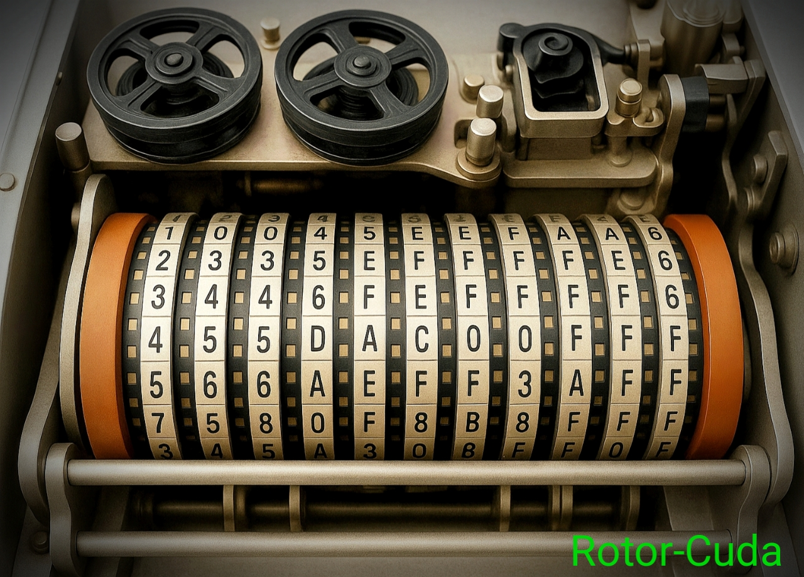

# Rotor-Cuda  v2.0


This is a modified version of KeyHunt v1.7 ... 
A lot of gratitude to all the developers whose codes has been used here  
Also, many thanks to the friends who allowed the Rotor-Cuda version 2 to be built and tested on their servers.

Telegram  **https://t.me/CryptoCrackersUK**

## Changes :
- Default Random 95% (252-256) bit + 5% (248-252) bit
- Random in a given bit range (1-256)
- Random between given bit ranges -n ? -z ?
- Automatic creation of Rotor-Cuda_START.bat with the specified cmd parameters
- Many small visual improvements

### To scan in (GPUs)
- **-n ?** save checkpoint every ? minutes. (1-10000)
- If you do not specify -n ? (search without continuing) 
- After the Rotor-Cuda_Continue.bat file appears, you can continue from the last checkpoint.
- To continue correctly, do not change the parameters inside the file.
- **If you do not need to continue, DELETE the Rotor-Cuda_Continue.bat !!!** 
---
### For Random use - r 5 (GPUs)
- **-r ?** When you enter -r 5, it means that up to 5 billion keys are allowed to be scanned and after that, randomly selected sections will be scanned
- **-n ?** (1-256) bit. If you do not specify -n will be the default 95% (252-256) bit + 5% (248-252) bit
- **-z ?** (end random range must be greater than -n value) example: -n 252 -z 256
- Random for search [puzzle](https://privatekeys.pw/puzzles/bitcoin-puzzle-tx) 71 example:

- ```./Rotor -g --gpui 0 --gpux 256,256 -m address --coin BTC -r 5 --range 400000000000000000:7fffffffffffffffff 1PWo3JeB9jrGwfHDNpdGK54CRas7fsVzXU``` 
- If your GPU is weaker than RTX 1080 or the driver crashes. Remove **--gpux 256,256** from the row the grid will be auto-assigned
---
### GPU Bitcoin Multi Address mode :
- Range: ```./Rotor -g --gpui 0 --gpux 256,256 -m addresses --coin BTC --range 400000000:7ffffffff -i Btc-h160.bin```
- Random: ```./Rotor -g --gpui 0 --gpux 256,256 -m addresses --coin BTC -r 5 -i Btc-h160.bin```
---
### GPU Bitcoin Single Address mode :
- Range: ```./Rotor -g --gpui 0 --gpux 256,256 -m address --coin BTC --range 400000000:7ffffffff 1PWCx5fovoEaoBowAvF5k91m2Xat9bMgwb```
- Random: ```./Rotor -g --gpui 0 --gpux 256,256 -m address --coin BTC --range 400000000:7ffffffff -r 5 1PWCx5fovoEaoBowAvF5k91m2Xat9bMgwb```
---
### GPU ETHEREUM Multi Address mode :
- Range: ```./Rotor -g --gpui 0 --gpux 256,256 -m addresses --coin eth --range 4000000:ffffffff -i eth.bin```
- Random: ```./Rotor -g --gpui 0 --gpux 256,256 -m addresses --coin eth --rang 4000000:ffffffff -r 5 -i eth.bin```
---
### GPU ETHEREUM Single Address mode :
- Range: ```./Rotor -g --gpui 0 --gpux 256,256 -m address --coin eth --range 8000000:fffffff 0xfda5c442e76a95f96c09782f1a15d3b58e32404f```
- Random: ```./Rotor -g --gpui 0 --gpux 256,256 -m address --coin eth --range 8000000:fffffff -r 5 0xfda5c442e76a95f96c09782f1a15d3b58e32404f```

**🕹Do not use non-standard values ​​for Grid size.They must be a multiple of 32**

  |    GPU card   |     Speed     |   Grid size   | 
  |---------------|:-------------:|---------------|
  |   Tesla  T4   |   600 Mkeys   |    128×256    |
  |   RTX  3090   |   1.4 Gkeys   |    256×256    |
  |   RTX  4090   |   3.2 Gkeys   |    256×512    |
  |   RTX  5090   |   4.7 Gkeys   |    512×512    |
  |   RTX  60xx   |   ??? Gkeys   |    xxx.xxx    |


---
### Range Scan Sequentially :
```
$./Rotor -g --gpui 0 --gpux 256,256 -m address --coin BTC --range 1000000000:1fffffffff 14iXhn8bGajVWegZHJ18vJLHhntcpL4dex

  Rotor-Cuda v2.0  Mehdi256

  COMP MODE    : COMPRESSED
  COIN TYPE    : BITCOIN
  SEARCH MODE  : Single Address
  DEVICE       : GPU
  GPU IDS      : 0
  GPU SIZE     : 256x256
  SSE          : YES
  BTC ADDRESS  : 14iXhn8bGajVWegZHJ18vJLHhntcpL4dex
  OUTPUT FILE  : Found.txt

  Start Time   : Sun Sep 21 06:51:02 2025
 
  Global start : 1000000000 (37 bit)
  Global end   : 1FFFFFFFFF (37 bit)
  Global range : FFFFFFFFF (36 bit)

  GPU Mode     : GPU #0 NVIDIA GeForce RTX 4090 (128x0 cores) Grid (256x256)

  Rotor info   : Divide the range FFFFFFFFF (278 bit) into GPU 65536 threads 

  Thread 00000 : 1000000000 -> 10000FFFFF 
  Thread 00001 : 10000FFFFF -> 10001FFFFE 
  Thread 00002 : 10001FFFFE -> 10002FFFFD 
  Thread 00003 : 10002FFFFD -> 10003FFFFC 
  Thread 65534 : 1FFFDF0002 -> 1FFFEF0001 
  Thread 65535 : 1FFFEF0001 -> 1FFFFF0000 
  Thread 65536 : 1FFFFF0000 -> 20000EFFFF 

  [00:00:07] [15D98444CC] [F: 0] [00:01:07] [C: 36.132813 %] [GPU: 3.60 Gk/s] [T: 24,830,279,680]  
  ================================================================================================
  PubAddress: 14iXhn8bGajVWegZHJ18vJLHhntck8EEPa
  Priv (WIF): KwDiBf89QgGbjEhKnhXJuH7LrciVrZi3qYjgd9NRuiZFAX5a6P5M
  Priv (HEX): 1757756A93
  PubK (HEX): 027D2C03C3EF0AEC70F2C7E1E75454A5DFDD0E1ADEA670C1B3A4643C48AD0F1255

  [00:00:07] [16008246F6] [F: 1] [00:01:06] [C: 37.109375 %] [GPU: 3.61 Gk/s] [T: 25,501,368,320] 
   
```
### Range Scan Randomly : 
```
$./Rotor -g --gpui 0 --gpux 256,256 -m address --coin BTC --range 1000000000:1fffffffff -r 5 14iXhn8bGajVWegZHJ18vJLHhntcpL4dex

  Rotor-Cuda v2.0  Mehdi256

  COMP MODE    : COMPRESSED
  COIN TYPE    : BITCOIN
  SEARCH MODE  : Single Address
  DEVICE       : GPU
  GPU IDS      : 0
  GPU SIZE     : 256x256
  SSE          : YES
  BTC ADDRESS  : 14iXhn8bGajVWegZHJ18vJLHhntcpL4dex
  OUTPUT FILE  : Found.txt

  Start Time   : Sun Sep 21 07:05:02 2025

  GPU Mode     : GPU #0 NVIDIA GeForce RTX 4090 (128x0 cores) Grid (256x256)
  Base Key     : Randomly changes 65536 start Private keys every 5,000,000,000 on the counter
  ROTOR Random : Min 37 (bit) 1000000000 
  ROTOR Random : Max 37 (bit) 1FFFFFFFFF 

  |00:00:27| R : 17 | 17E005E2C7 | F : 0 | GPU: 3.57 Gk/s | T: 95,428,804,608 |  
  ================================================================================================
  PubAddress: 14iXhn8bGajVWegZHJ18vJLHhntck8EEPa
  Priv (WIF): KwDiBf89QgGbjEhKnhXJuH7LrciVrZi3qYjgd9NRuiZFAX5a6P5M
  Priv (HEX): 1757756A93
  PubK (HEX): 027D2C03C3EF0AEC70F2C7E1E75454A5DFDD0E1ADEA670C1B3A4643C48AD0F1255

  |00:00:27| R : 17 | 17E00605C5 | F : 1 | GPU: 3.57 Gk/s | T: 96,099,893,248 |   

```
### Range Scan with Multi Address : 
```
$./Rotor -g --gpui 0 --gpux 256,256 -m addresses --coin BTC --range 1000000000:1fffffffff -r 5 -i Puzzles_h160.bin

  Rotor-Cuda v2.0  Mehdi256

  COMP MODE    : COMPRESSED
  COIN TYPE    : BITCOIN
  SEARCH MODE  : Multi Address
  DEVICE       : GPU
  GPU IDS      : 0
  GPU SIZE     : 256x256
  SSE          : YES
  BTC HASH160s : Puzzles_h160.bin
  OUTPUT FILE  : Found.txt

  Loading      : 160 %
  Loaded       : 160 Bitcoin addresses

  Bloom at     : 0x5b675c9509a0
  Version      : 2.1
  Entries      : 322
  Error        : 0.0000010000
  Bits         : 9259
  Bits/Elem    : 28.755175
  Bytes        : 1158 (0 MB)
  Hash funcs   : 20

  Site         : https://github.com/Mehdi256/Rotor-Cuda 
  Donate       : bc1qdfaj5zyvfkr7wtzaa72vqxzztpl2tz7g5zk5ug 

  Start Time   : Sun Sep 21 18:06:29 2025

  GPU Mode     : GPU #0 NVIDIA GeForce RTX 4090 (128x0 cores) Grid (256x256)
  Base Key     : Randomly changes 65536 start Private keys every 5,000,000,000 on the counter
  ROTOR Random : Min 37 (bit) 1000000000 
  ROTOR Random : Max 37 (bit) 1FFFFFFFFF 

  |00:00:18| R : 15 | 167ABCD68F | F : 0 | GPU: 3.53 Gk/s | T: 81,604,378,624 |  
  ================================================================================================
  PubAddress: 14iXhn8bGajVWegZHJ18vJLHhntcnHyduN
  Priv (WIF): KwDiBf89QgGbjEhKnhXJuH7LrciVrZi3qYjgd9NRuiZFAX5a6P5M
  Priv (HEX): 1757756A93
  PubK (HEX): 027D2C03C3EF0AEC70F2C7E1E75454A5DFDD0E1ADEA670C1B3A4643C48AD0F1255

  |00:00:18| R : 15 | 16F55BF6A1 | F : 1 | GPU: 3.53 Gk/s | T: 82,328,530,944 | 

```
### Puzzle 71 Scan with Multi GPU : 
```
$./Rotor -g --gpui 0,1,2 --gpux 256,256,256,256,256,256 -m address --coin BTC --range 400000000000000000:7fffffffffffffffff -r 15 1PWo3JeB9jrGwfHDNpdGK54CRas7fsVzXU

  Rotor-Cuda v2.0  Mehdi256

  COMP MODE    : COMPRESSED
  COIN TYPE    : BITCOIN
  SEARCH MODE  : Single Address
  DEVICE       : GPU
  GPU IDS      : 0, 1, 2
  GPU SIZE     : 256x256, 256x256, 256x256
  SSE          : YES
  BTC ADDRESS  : 1PWo3JeB9jrGwfHDNpdGK54CRas7fsVzXU
  OUTPUT FILE  : Found.txt

  Start Time   : Tue Sep 21 16:58:42 2025

  GPU Mode     : GPU #0 NVIDIA GeForce RTX 4090 (128x0 cores) Grid (256x256)
  Base Key     : Randomly changes 262144 start Private keys every 15,000,000,000 on the counter
  ROTOR Random : Min 71 (bit) 400000000000000000
  ROTOR Random : Max 71 (bit) 7FFFFFFFFFFFFFFFFF

  GPU Mode     : GPU #1 NVIDIA GeForce RTX 4090 (128x0 cores) Grid (256x256)
  Base Key     : Randomly changes 262144 start Private keys every 15,000,000,000 on the counter
  ROTOR Random : Min 71 (bit) 400000000000000000
  ROTOR Random : Max 71 (bit) 7FFFFFFFFFFFFFFFFF

  GPU Mode     : GPU #2 NVIDIA GeForce RTX 4090 (128x0 cores) Grid (256x256)
  Base Key     : Randomly changes 262144 start Private keys every 15,000,000,000 on the counter
  ROTOR Random : Min 71 (bit) 400000000000000000
  ROTOR Random : Max 71 (bit) 7FFFFFFFFFFFFFFFFF

  |00:24:09| R : 1250 | 61AE654C8F21375303 | F : 0 | GPU: 10.96 Gk/s | T: 18,874,233,782,272 |
  
  ```
# Linux
- **🕹Note : Do not edit the Makefile in this version (No edit Makefile)**

- update & Install libgmp: **sudo apt update**```**sudo apt install -y libgmp-dev**

- CUDA       = /usr/local/cuda-11.0

- CXXCUDA    = /usr/bin/g++

- To build CPU-only version :

  ```sh
  
    make all
  
  ```
- To build with CUDA (GPU)

- To get info about various Nvidia GPU CCAP value see : 
  
   #### https://arnon.dk/matching-sm-architectures-arch-and-gencode-for-various-nvidia-cards

  ```sh

    cd Rotor-Cuda 

    make gpu=1 CCAP=75 all     [SM_75]

    make gpu=1 CCAP=89 all     [SM_89]

    make gpu=1 CCAP=100 all   [SM_100]

  ```

## License
- Rotor-Cuda is licensed under GPLv3.0

## Donation
- BTC: bc1qdfaj5zyvfkr7wtzaa72vqxzztpl2tz7g5zk5ug

## __Disclaimer__
  ALL THE CODES, PROGRAM AND INFORMATION ARE FOR EDUCATIONAL PURPOSES ONLY. USE IT AT YOUR OWN RISK. THE         DEVELOPER WILL NOT BE RESPONSIBLE FOR ANY LOSS, DAMAGE OR CLAIM ARISING FROM USING THIS PROGRAM.

## Good luck hunting ;) 

